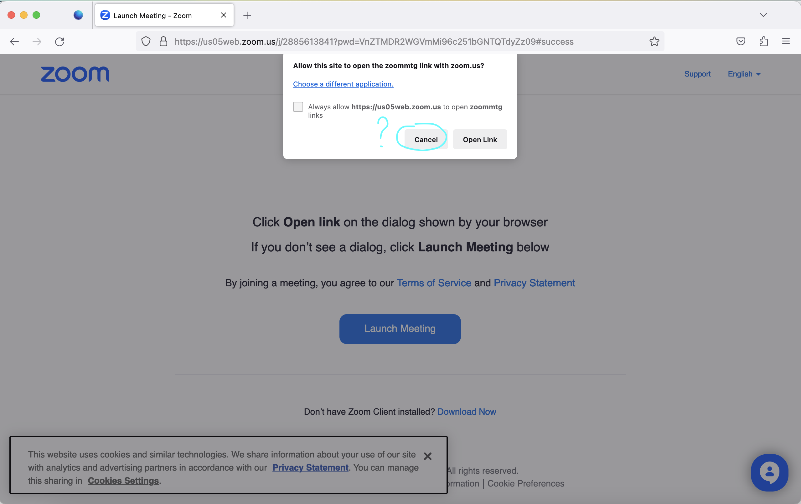

## Close dialog pop-up using playwright

### Setup instructions
1. `git clone git@github.com:yugri/dialog-playwright.git` 
2. `cd dialog-playwright`
3. `pip install -r requirements.txt`
4. `python3 main.py`

### The problem
A system dialog window can't be closed using playwright.
Dialog window is shown below.

